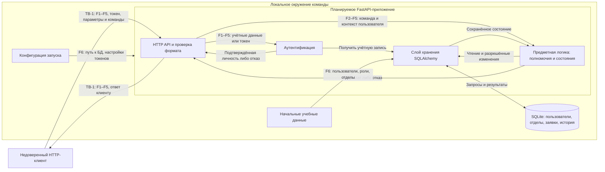

# Модель угроз WildBurny

Модель подготовлена на S03 для сценариев и границы из [паспорта](PROJECT.md).
Она связывает способы нарушения свойств продукта с
[требованиями безопасности](SECURITY_REQUIREMENTS.md) и задаёт вход для S04.

## 1. Модель продукта

**Что существует:** паспорт, требования безопасности и входная страница проекта.
Кода приложения, схемы базы и работающих маршрутов в репозитории пока нет.
Описанные ниже угрозы — сценарии для проектирования, а не обнаруженные
уязвимости работающей реализации.

**Что планируется:** локальный REST API на FastAPI, проверка данных Pydantic,
аутентификация с токеном, предметная логика полномочий и переходов, хранение
через SQLAlchemy в SQLite. Это один серверный процесс и локальная база;
внутренние блоки схемы не являются отдельными сервисами.

### Архитектура и потоки

| Поток / точка входа | Направление и данные | Решение и возможное изменение |
| --- | --- | --- |
| F1. Вход | Клиент → API → аутентификация → хранение; логин и пароль. Обратно — токен либо отказ | Аутентификация устанавливает личность по серверной учётной записи; предметные данные не меняются |
| F2. Создание заявки | Клиент → API → предметная логика → SQLite; токен, название, описание, количество, сумма, обоснование | Предметная логика определяет автора и отдел, проверяет допустимость создания; сохраняются заявка в `SUBMITTED` и первое событие |
| F3. Чтение | Клиент → API → предметная логика → SQLite и обратно; токен, ID заявки или параметры списка, запрос истории | Предметная логика определяет доступный пользователю набор заявок; ответ содержит только разрешённые данные |
| F4. Решение руководителя | Клиент → API → предметная логика → SQLite; токен, ID, одобрение либо отклонение, причина | Проверяются роль, отдел и исходное состояние; меняются состояние и история |
| F5. Закупка | Клиент → API → предметная логика → SQLite; токен, ID, команда заказа с номером либо команда завершения | Проверяются роль и исходное состояние; меняются номер заказа, состояние и история |
| F6. Запуск | Локальная конфигурация → приложение; начальные данные → слой хранения → SQLite | Команда задаёт окружение и начальные учётные записи; это не публичный API |

Проверка здоровья сервера (`GET /health`) также планируется и доступна без
аутентификации; она не должна возвращать предметные данные. Остальные точные URL
и поля API ещё не определены. Названия операций в модели обозначают их смысл.
Чтение истории рассматривается отдельно от чтения самой заявки, даже если позже
они окажутся в одном маршруте.

### Существенные допущения

- Клиент может полностью менять HTTP-запросы, знать ID чужих заявок, повторять
  команды и отправлять их одновременно. Действительный токен не делает
  параметры и команды доверенными.
- Сотрудник и руководитель ограничены владельцем и отделом соответственно.
  Для закупщика на S03 уточнено чтение: `APPROVED`, `ORDERED` и `COMPLETED`
  всех отделов, включая историю; `SUBMITTED` и `REJECTED` ему недоступны
  ([SR-09]). Это уточнение фразы «одобренные и принятые в работу заявки»
  из паспорта, а не новая роль.
- Команда контролирует локальный процесс, конфигурацию, файл SQLite и начальные
  данные; клиент API не имеет к ним прямого доступа. Сбой записи или остановка
  процесса при этом возможны и учитываются в T-06.
- Модель относится к запуску на локальной машине без публикации в сети.
  Компрометация ОС, прямое изменение файла БД и перехват трафика между машинами
  находятся за этой границей. Перед сетевым размещением модель нужно расширить.
- Нет регистрации, админ-панели, вложений, браузерного frontend, платёжных
  операций и внешних сервисов. Номер заказа — учебное значение в БД;
  ошибочная запись не означает реального списания денег или заказа у поставщика.

## 2. Граница доверия

| Граница | Что пересекает | Почему требуется проверка |
| --- | --- | --- |
| TB-1: внешний HTTP-клиент ↔ серверный API | Внутрь: логин, пароль, токен, ID, параметры списка, поля заявки, решение, причина и номер заказа. Наружу: токен, заявки, история, ошибки | Источником запроса управляет клиент, включая аутентифицированного нарушителя. Формат, личность, полномочия и допустимость команды проверяются независимо. В ответе также нельзя раскрывать лишние данные |

API, аутентификация, предметная логика, SQLAlchemy и SQLite входят в один
доверенный локальный контур. Между ними есть вызовы и записи, но отдельная
граница доверия не вводится: ошибка внутреннего компонента всё равно может
нарушить свойства продукта. Проверка типов в API не заменяет решение предметной
логики по сохранённым роли, владельцу, отделу и состоянию.

## 3. Значимые объекты и свойства

Объекты и последствия описаны в [разделе 5 паспорта](PROJECT.md#5-значимые-данные-и-другие-объекты).
Для этой модели существенны:

- личность, роль и отдел пользователя — [SR-01], [SR-02];
- конфиденциальность заявки и истории — [SR-03], [SR-09];
- полномочия на решение и закупку — [SR-04], [SR-05];
- допустимое состояние и согласованная история действий — [SR-06], [SR-07];
- отсутствие чувствительных данных в ошибках — [SR-08];
- корректность и неизменность содержания заявки, обязательные данные команды — [SR-10].

## 4. Шкала приоритетов

**Высокий:** реалистичный запрос или сочетание запросов нарушает доступ,
согласование либо достоверность результата основного сценария. Выбор защиты
влияет на проектирование уже на S04.

**Средний:** существенное нарушение требует дополнительного условия — например,
сбоя процесса, ошибочно доступной операции истории или диагностического ответа.
Его необходимо учесть при реализации и проверке соответствующего свойства.

Приоритетный набор для S04 указан только в разделе 5. Высокая оценка сама по
себе не означает включение в этот набор: выбраны сценарии, определяющие основные
инженерные решения. Остальные угрозы сохраняются в модели.

### T-01. Доступ без действительной аутентификации

- **Сценарий:** внешний клиент вызывает чтение заявки, истории или команду
  изменения без токена, с повреждённым, поддельным либо просроченным токеном.
  Если хотя бы одна предметная операция пропускает такую проверку, запрос
  исполняется как аутентифицированный.
- **Последствие:** раскрытие предметных данных или изменение заявки от
  неподтверждённого пользователя.
- **Вход:** TB-1, F2–F5, данные аутентификации запроса.
- **Связанные требования:** [SR-01].
- **Приоритет:** высокий. Запрос не требует доступа к локальному окружению;
  нарушение затрагивает все основные сценарии.

### T-02. Подмена автора и служебных полей при создании

- **Сценарий:** сотрудник дополняет запрос создания чужим автором или отделом,
  привилегированной ролью либо начальным состоянием `APPROVED`. Сервер переносит
  клиентские значения в контекст полномочий или сохраняемую заявку.
- **Последствие:** заявка приписана другому человеку, попадает в чужой отдел
  либо считается согласованной без решения руководителя.
- **Вход:** TB-1, F2, дополнительные поля тела запроса.
- **Связанные требования:** [SR-02], [SR-06], [SR-07].
- **Приоритет:** высокий. Нужна только обычная учётная запись; одна подмена
  разрушает доверие к авторству или начальному состоянию основного процесса.

### T-03. Чтение чужой заявки сотрудником или руководителем

- **Сценарий:** сотрудник подставляет ID заявки другого автора, а руководитель —
  ID заявки другого отдела. Либо они получают те же данные через список,
  изменённый фильтр или запрос истории, где ограничение доступа забыто.
- **Последствие:** раскрываются товар, сумма, обоснование и решения, которых
  пользователь не должен видеть.
- **Вход:** TB-1, F3, ID заявки и параметры списка или истории.
- **Связанные требования:** [SR-03].
- **Приоритет:** высокий. ID можно знать заранее, а чтение — основной сценарий;
  проверки только одиночной заявки недостаточно для остальных путей выдачи.

### T-04. Исполнение команды чужой роли или отдела

- **Сценарий:** сотрудник, закупщик или руководитель другого отдела напрямую
  вызывает одобрение либо отклонение заявки. Сотрудник или руководитель также
  может вызвать запись номера заказа или завершение закупки. Сервер проверяет
  наличие токена, но не полномочия на конкретную команду и заявку.
- **Последствие:** решение или закупка фиксируется пользователем, которому
  такое действие не разрешено, даже при формально допустимом состоянии заявки.
- **Вход:** TB-1, F4–F5, команда, ID заявки и номер заказа.
- **Связанные требования:** [SR-04], [SR-05].
- **Приоритет:** высокий. Достаточно прямого HTTP-запроса; под угрозой оба этапа
  обработки заявки. Наличие или отсутствие кнопки в клиенте ничего не меняет.

### T-05. Обход жизненного цикла повторными и конкурирующими командами

- **Сценарий:** пользователь с подходящей ролью пытается заказать `SUBMITTED`,
  завершить `APPROVED`, повторить заказ или продолжить `REJECTED`/`COMPLETED`.
  Другой вариант — два запроса одобрения и отклонения одновременно читают
  `SUBMITTED`, либо два запроса заказа читают `APPROVED`, и каждый считает
  переход допустимым до сохранения результата другого запроса.
- **Последствие:** пропущен или повторён этап, перезаписан номер заказа,
  потеряно решение или записаны несовместимые события одной заявки.
- **Вход:** TB-1, F4–F5; сочетание проверки текущего состояния и записи в SQLite.
- **Связанные требования:** [SR-06], [SR-07].
- **Приоритет:** высокий. Повтор возможен после потери ответа без злого умысла,
  а параллельные запросы доступны обычному клиенту. Проверки каждого запроса
  отдельно недостаточно для согласованного результата пары запросов.

### T-06. Состояние и история расходятся при сбое записи

- **Сценарий:** при создании заявки или разрешённом переходе процесс
  останавливается либо запись завершается ошибкой после сохранения заявки,
  но до сохранения события истории; возможен и обратный порядок.
- **Последствие:** состояние или номер заказа изменились без объясняющего
  события, либо история сообщает о действии, которое не стало состоянием
  заявки. Результат согласования нельзя достоверно восстановить.
- **Вход:** обработка F2, F4–F5, взаимодействие предметной логики, SQLAlchemy
  и SQLite внутри локального контура; злоумышленник не обязателен.
- **Связанные требования:** [SR-07].
- **Приоритет:** средний. Нужен сбой в определённый момент, но он реалистичен
  и касается всех записей. Граница согласованного сохранения должна быть
  определена при проектировании, поэтому угроза включена в набор S04.

### T-07. Подмена или удаление события истории через API

- **Сценарий:** клиент передаёт произвольного участника, время или результат
  события вместе с командой либо обращается к ошибочно доступной операции
  изменения/удаления существующего события. Сервер принимает эти данные или
  позволяет менять историю независимо от фактического действия.
- **Последствие:** исчезает след решения либо появляется ложное авторство,
  время, причина или результат; историю нельзя использовать для проверки.
- **Вход:** TB-1, F2, F4–F5 и попытка прямого запроса к объекту истории.
  Такой маршрут не запланирован; угроза проверяет отсутствие лишних операций.
- **Связанные требования:** [SR-02], [SR-07].
- **Приоритет:** средний. Последствия существенны, но сценарий требует
  ошибочного принятия служебных полей или появления непредусмотренной операции.

### T-08. Раскрытие данных в ответе об ошибке

- **Сценарий:** клиент вызывает ошибку входа, запрашивает чужую заявку,
  передаёт некорректные значения или недопустимую команду. Обработчик возвращает
  токен/пароль из входа, содержимое недоступной заявки, текст исключения,
  трассировку стека либо структуру базы.
- **Последствие:** через отказ в операции раскрываются учётные данные,
  чужие сведения или внутреннее устройство приложения.
- **Вход:** TB-1 в направлении сервер → клиент, ответы F1–F5.
- **Связанные требования:** [SR-08].
- **Приоритет:** средний. Ошибку вызвать просто, но раскрытие зависит от
  содержимого диагностики. При проектировании ответов нужно охватить отказы
  всех слоёв, включая проверку входных данных.

### T-09. Закупщик читает ещё не одобренные или отклонённые заявки

- **Сценарий:** закупщик запрашивает `SUBMITTED` или `REJECTED` по известному
  ID либо получает их в общем списке или истории. Сервер считает роль закупщика
  достаточной для чтения любой заявки и не учитывает её состояние.
- **Последствие:** закупщику раскрываются не переданные в закупку потребности,
  суммы и причины отклонения.
- **Вход:** TB-1, F3, ID заявки, список и история.
- **Связанные требования:** [SR-09].
- **Приоритет:** высокий. Это обычный запрос действительного пользователя;
  ошибка затрагивает конфиденциальность заявок всех отделов. В отличие от T-03,
  здесь решающим условием является состояние заявки.

### T-10. Некорректные значения и подмена согласованного содержания

- **Сценарий:** сотрудник создаёт заявку с нулевым, отрицательным или дробным
  количеством, некорректной суммой либо пустым обязательным текстом. Руководитель
  отклоняет её с причиной из одних пробелов, либо закупщик заказывает без номера.
  Сервер принимает значения или молча округляет их и сохраняет результат.
  Другой вариант: закупщик добавляет новую положительную сумму или количество
  в допустимую команду заказа, и сервер изменяет уже согласованное содержание.
- **Последствие:** согласуется и обрабатывается неверная покупка, теряется
  смысл решения или связь с учебным заказом; итоговая покупка может отличаться
  от согласованной. Редактирование отправленного содержания не входит в
  разрешённые действия пользователя.
- **Вход:** TB-1, F2, F4–F5, поля заявки, причина и номер заказа.
- **Связанные требования:** [SR-10], [SR-04].
- **Приоритет:** высокий. Достаточно одного запроса; те же ошибки возможны
  случайно и непосредственно влияют на результат сквозного сценария.

## 5. Приоритетный набор для S04

**T-01, T-03, T-04, T-05, T-06.**

Выбраны установление личности, чтение в пределах доступа, полномочия на команды,
допустимость последовательных и одновременных переходов, а также согласованность
состояния с историей. Вместе они охватывают подачу, согласование и закупку и
определяют основные места принятия решений в приложении. T-06 включена несмотря
на среднюю оценку: без её учёта успешное согласование может не оставлять
достоверного следа.

T-02, T-07, T-08, T-09 и T-10 остаются обязательными входами для реализации
соответствующих SR. При работе с выбранным набором нужно также проверить источник
служебных полей, запрет изменения истории, ответы об ошибках, чтение закупщика
и корректность ввода. Они не считаются устранёнными или принятыми рисками.

## 6. Уточнения S03 и следующий шаг

- Модель использует все SR-01–SR-08 из S02. Для T-09 и T-10 добавлены SR-09 и
  SR-10: исходные требования не определяли чтение закупщика и допустимые
  значения всех предметных полей. Для SR-06 и SR-07 добавлены критерии
  конкурентных запросов и сбоя сохранения; исходные свойства сохранены.
- Точные маршруты API и ограничения размеров запросов пока не определены.
  Модель не доказывает устойчивость к исчерпанию ресурсов. Если появятся
  сетевой доступ или требования к нагрузке, потребуются отдельные сценарии
  доступности и проверяемые требования к ограничениям.
- На S04 нужно выбрать и обосновать решения `D-*` для всего приоритетного
  набора, связать их с SR и определить будущие проверки. Конкретные механизмы
  защиты и результаты тестов этим документом не утверждаются.
- После появления реализации нужно сверить с ней потоки и точки входа,
  проверить все пути выдачи данных, повторные/одновременные команды и ошибки
  записи. До EK1 по паспорту требуется минимальная запускаемая основа;
  специального технического результата для S03 нет.

[SR-01]: SECURITY_REQUIREMENTS.md#sr-01-аутентификация-доступа-к-предметным-данным
[SR-02]: SECURITY_REQUIREMENTS.md#sr-02-доверенный-источник-личности-и-полномочий
[SR-03]: SECURITY_REQUIREMENTS.md#sr-03-ограничение-чтения-заявок-и-истории
[SR-04]: SECURITY_REQUIREMENTS.md#sr-04-полномочия-руководителя-на-принятие-решения
[SR-05]: SECURITY_REQUIREMENTS.md#sr-05-полномочия-закупщика-на-проведение-закупки
[SR-06]: SECURITY_REQUIREMENTS.md#sr-06-целостность-жизненного-цикла-заявки
[SR-07]: SECURITY_REQUIREMENTS.md#sr-07-целостность-и-прослеживаемость-истории
[SR-08]: SECURITY_REQUIREMENTS.md#sr-08-отсутствие-чувствительных-данных-в-ошибках
[SR-09]: SECURITY_REQUIREMENTS.md#sr-09-границы-чтения-для-закупщика
[SR-10]: SECURITY_REQUIREMENTS.md#sr-10-корректность-и-неизменность-предметных-данных
